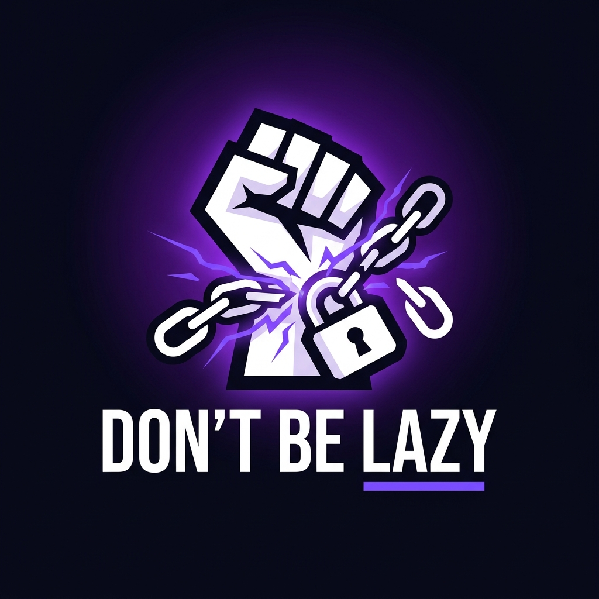

<div align="center">



# 🧱 Don't Be Lazy

**Ép bản thân làm việc bằng cách chặn tất cả những thứ không liên quan.**

[](./LICENSE)
[](https://github.com/ThanhTrunggDEV/DontBeLazy/releases)
[](https://github.com/ThanhTrunggDEV/DontBeLazy/actions/workflows/release.yml)
[](./CONTRIBUTING.md)
[](https://paypal.me/ntt68)

🌏 **Tiếng Việt** | **[English](./README.en.md)**

</div>

---

## 🎯 Vấn đề

Bạn ngồi vào bàn làm việc, mở máy tính lên và 2 tiếng sau nhận ra mình vừa lướt Facebook, xem YouTube và chẳng làm được gì? **Don't Be Lazy** sinh ra để giải quyết đúng vấn đề đó.

Không giống các app chặn web thông thường dễ dàng bị tắt đi, **Don't Be Lazy** hoạt động theo cơ chế **Whitelist-first**: chặn toàn bộ mọi thứ, chỉ cho phép những gì bạn cần để làm việc.

---

## ✨ Tính năng chính

| Tính năng | Mô tả |
|---|---|
| 📋 **Task Management** | Tạo task một lần hoặc lặp lại (Daily/Weekly/Custom), gắn Whitelist Profile, theo dõi trạng thái |
| 🔒 **Whitelist per Task** | Mỗi task có bộ Whitelist Profile riêng — Task "Code" chỉ mở VS Code, Task "Học" chỉ mở từ điển |
| 🛡️ **Focus Mode** | Kích hoạt chế độ chặn toàn bộ internet & app ngoài Whitelist trong khi làm việc |
| ⚔️ **Strict Mode** | Không thể Stop, không thể sửa Whitelist, không thể kill app bằng Task Manager |
| 🧠 **Psychological Tricks** | Friction, Guilt-tripping, Loss Aversion, Implementation Intention |
| 🤖 **AI Assistant** | Gemini AI gợi ý ưu tiên task, phân tích bước thực hiện, tạo Whitelist Profile tự động |
| 💬 **Motivation Quotes** | AI tự động sinh câu quote cản bỏ cuộc tại các thời điểm chiến lược |
| 📊 **Analytics** | Streak, biểu đồ thời gian tập trung, thống kê số lần "cố gắng" phá luật |
| 🔄 **Auto-Update** | Tự kiểm tra và cài bản mới từ GitHub Releases khi khởi động |

---

## 🧠 Tâm lý học trong thiết kế

> *Don't Be Lazy không chỉ chặn web — nó ép não bộ của bạn tuân thủ.*

- **Implementation Intention:** Trước khi Start, bạn phải tự tay gõ cam kết mục tiêu.
- **Friction:** Muốn bỏ cuộc? Hãy tự tay gõ: *"Tôi là kẻ lười biếng và tôi chấp nhận bỏ cuộc"*.
- **Loss Aversion:** Streak hiển thị rõ ràng. Bỏ cuộc = Streak về 0.
- **Guilt-tripping:** AI tạo câu quote cá nhân hoá trước khi cho phép bỏ cuộc.

---

## 🚀 Cài đặt

### Tải bản mới nhất

Vào [**Releases**](https://github.com/ThanhTrunggDEV/DontBeLazy/releases) và tải:

| File | Mô tả |
|---|---|
| `DontBeLazy-x.y.z-win-x64.msi` | **Khuyên dùng** — Installer đầy đủ, tạo shortcut, hỗ trợ uninstall |
| `DontBeLazy-x.y.z-win-x64-portable.zip` | Portable — Giải nén và chạy thẳng, không cần cài |

> **Yêu cầu:** Windows 10/11 64-bit. .NET runtime đã nhúng sẵn, không cần cài thêm.

### Chạy từ source

```bash
# Clone repo
git clone https://github.com/ThanhTrunggDEV/DontBeLazy.git
cd DontBeLazy

# Cài .NET 9 SDK nếu chưa có: https://dotnet.microsoft.com/download

# Chạy ứng dụng
dotnet run --project src/DontBeLazy.WPF/DontBeLazy.WPF.csproj
```

> **AI Features:** Tạo file `.env` trong thư mục WPF hoặc đặt biến môi trường `GEMINI_API_KEY=your_key_here`

---

## 🏗️ Tech Stack

| Layer | Công nghệ |
|---|---|
| **UI** | WPF .NET 9, Material Design in XAML 5.3, MVVM (CommunityToolkit) |
| **Architecture** | Clean Architecture — Domain / Ports / UseCases / Infrastructure / WPF |
| **Database** | SQLite + EF Core 9 (migrations) |
| **AI** | Google Gemini API (Flash model) |
| **Installer** | WiX Toolset v4 (MSI) |
| **CI/CD** | GitHub Actions — auto build + release trên tag |

---

## 🗂️ Tài liệu dự án

- [📄 BA Document](./docs/ba_document.md) — Phân tích nghiệp vụ, tính năng, yêu cầu hệ thống
- [📋 Use Cases](./docs/use_cases.md) — Các luồng nghiệp vụ chi tiết
- [🏛️ Architecture](./docs/system_architecture.md) — Kiến trúc hệ thống
- [📝 Changelog](./CHANGELOG.md) — Lịch sử thay đổi
- [🤝 Contributing](./CONTRIBUTING.md) — Hướng dẫn đóng góp
- [🔒 Security](./SECURITY.md) — Chính sách bảo mật

---

## 🖥️ Nền tảng

- ✅ **Windows 10/11** (64-bit) — Đang hỗ trợ
- 🔜 macOS — Dự kiến

---

## 📜 License

Dự án được phân phối dưới giấy phép [MIT](./LICENSE).
